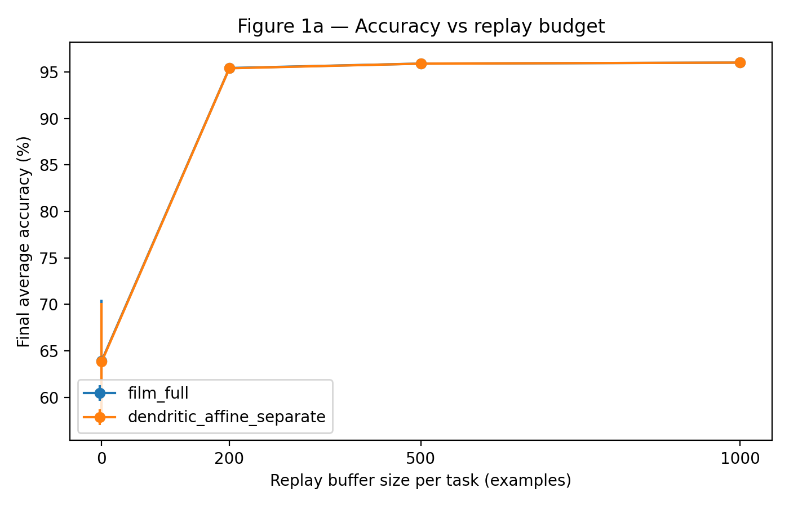
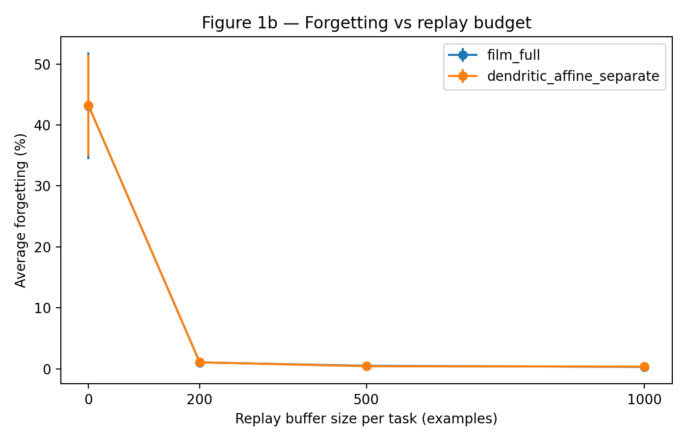

# Dendritic Contextual Routing

Biologically-inspired contextual routing for continual learning and feature-conflict resolution.

[](https://doi.org/10.5281/zenodo.20061176)

This repository introduces and evaluates a dendritic-inspired mechanism for contextual routing. To study when context becomes necessary, it also introduces the SDFC benchmark, where the same input features must be interpreted differently depending on task context.

The main finding is simple:

> Contextual affine modulation solves the feature-conflict structure; a 2% micro-replay buffer preserves it under sequential training.


## Why This Matters

Neural networks often fail when two tasks reuse the same features with opposite meanings. For example, one task may treat a feature as positive evidence while another task treats the same feature as negative evidence. A shared representation is then pulled in incompatible directions.

SDFC, short for Same-Dimension Feature Conflict, turns this into a controlled benchmark. The model receives the same input dimensions across tasks, but the correct interpretation changes with task context. This makes it possible to ask a precise question:

> When does contextual routing become functionally necessary, and what is required to preserve it under sequential training?


## Contribution

- A compact feature-conflict benchmark for contextual learning.
- A dendritic affine routing model that separates basal features from contextual modulation.
- A controlled comparison against FiLM-style affine modulation.
- A micro-replay sweep showing that 2% replay nearly closes the sequential-learning gap.
- Curated CSVs, figures, scripts, and citation metadata for reproducibility.

## Core Idea

The useful primitive is additive plus multiplicative contextual modulation:

```text
h = gamma(context) * h_basal + beta(context)
```

The dendritic affine variant implements the same functional primitive:

```text
h = g(context) * h_basal + a(context)
```

In this benchmark, the architectural framing matters less than the primitive: context must transform the representation, not merely appear as another input feature.

## Main Result

Without replay, sequential training damages the contextual solution. With a buffer containing only 2% of each task's training set, final accuracy rises from about 64% to 95.4%, and average forgetting drops from about 43% to about 1%.





The oldest mirror-conflicted task, task 0, recovers from about 28% to about 94% with only a 2% replay buffer.


Gate-similarity diagnostics suggest that replay stabilizes an already useful contextual routing structure rather than creating an entirely new one.


## Final Results

| Model | Replay | Accuracy | Forgetting |
|---|---:|---:|---:|
| `film_full` | 0% | ~63.9% | ~43.2% |
| `film_full` | 2% | ~95.4% | ~1.1% |
| `film_full` | 5% | ~95.9% | ~0.5% |
| `film_full` | 10% | ~96.0% | ~0.3% |
| `dendritic_affine_separate` | 0% | ~63.8% | ~43.2% |
| `dendritic_affine_separate` | 2% | ~95.4% | ~1.1% |
| `dendritic_affine_separate` | 5% | ~95.9% | ~0.4% |
| `dendritic_affine_separate` | 10% | ~96.0% | ~0.4% |

Replay budgets:

| Replay fraction | Examples per task |
|---:|---:|
| 0% | 0 |
| 2% | 200 |
| 5% | 500 |
| 10% | 1000 |

## Repository Layout

- `src/` - source code for SDFC generation, models, metrics, and training.
- `scripts/` - result aggregation and reproduction scripts.
- `configs/` - experiment configuration files.
- `artifacts/` - fixed SDFC projection and benchmark metadata.
- `results/raw_csv/` - curated raw CSV outputs.
- `results/main_tables/` - final paper tables.
- `paper/figures/` - final plots and README figures.
- `docs/README_REPRODUCIBILITY.md` - reproduction guide.
- `docs/EXPERIMENT_LOG.md` - experiment history.
- `CITATION.cff` - citation metadata.

## Quick Start

Install dependencies:

```powershell
python -m pip install -r requirements.txt
```

Generate the fixed benchmark projection:

```powershell
python -m src.main --make-benchmark --benchmark-seed 12345
```

Run the short smoke checks:

```powershell
powershell -ExecutionPolicy Bypass -File .\scripts\run_sdfc_replay_joint_smoke.ps1
powershell -ExecutionPolicy Bypass -File .\scripts\run_sdfc_replay_microbuffer_smoke.ps1
```

Regenerate README figures:

```powershell
python .\scripts\make_readme_figures.py
```

For full reproduction, see [`docs/README_REPRODUCIBILITY.md`](docs/README_REPRODUCIBILITY.md).

## Full Reproduction

From the repository root:

```powershell
python -m src.main --make-benchmark --benchmark-seed 12345
powershell -ExecutionPolicy Bypass -File .\scripts\run_sdfc_replay_joint_multiseed.ps1
powershell -ExecutionPolicy Bypass -File .\scripts\run_sdfc_replay_microbuffer_multiseed.ps1
```

Curated final outputs are stored in:

```text
results/raw_csv/
results/main_tables/
paper/figures/
```

## Citation

If you use this repository, please cite it using the metadata in [`CITATION.cff`](CITATION.cff).

The archived release is available through Zenodo:

```text
https://doi.org/10.5281/zenodo.20061176
```

## Attribution

This project was developed under OPAL-dev / OPAL.inc as an independent research exploration on contextual routing, continual learning, and dendritic-inspired architectures.

Main research and implementation: MantHalo / OPAL-dev.

Experimental design and analysis were assisted by multiple AI systems and cross-checked through iterative review.

## License

This project is released under the MIT License. See [`LICENSE`](LICENSE).
