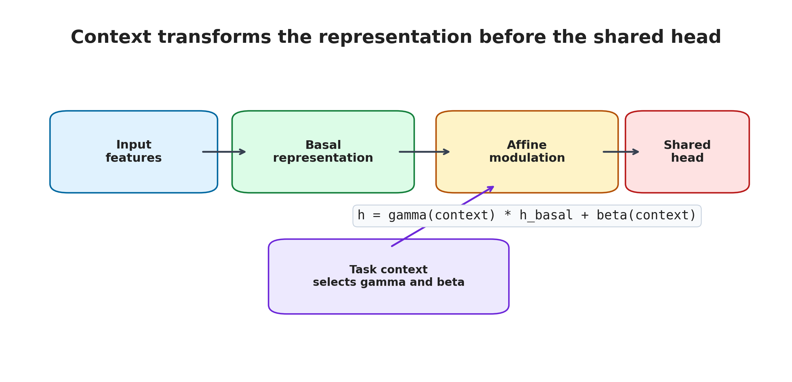
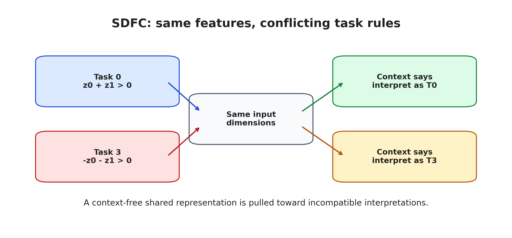
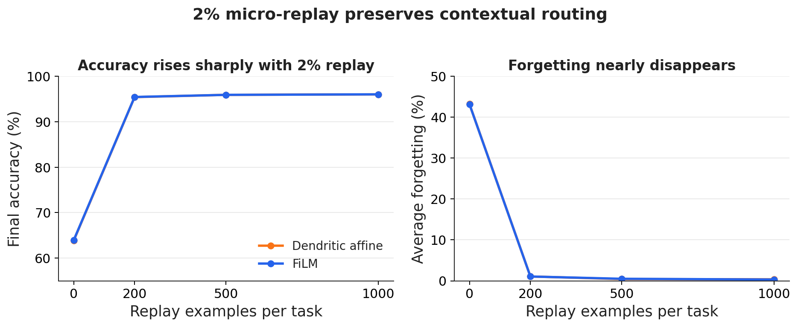

# Dendritic Contextual Routing

Biologically-inspired contextual routing for continual learning and feature-conflict resolution.

[](https://doi.org/10.5281/zenodo.20061176)

This repository introduces SDFC and evaluates a dendritic-inspired implementation of contextual affine routing. SDFC is a controlled benchmark where the same input features must be interpreted differently depending on task context.

The main finding is simple:

> Contextual affine modulation solves the feature-conflict structure; a 2% micro-replay buffer preserves it under sequential training.

<p align="center">
  
</p>

## Why This Matters

Neural networks often fail when two tasks reuse the same features with opposite meanings. For example, one task may treat a feature as positive evidence while another task treats the same feature as negative evidence. A shared representation is then pulled in incompatible directions.

SDFC, short for Same-Dimension Feature Conflict, turns this into a controlled benchmark. The model receives the same input dimensions across tasks, but the correct interpretation changes with task context. This makes it possible to ask a precise question:

> When does contextual routing become functionally necessary, and what is required to preserve it under sequential training?

<p align="center">
  
</p>

## Contribution

- A compact feature-conflict benchmark for contextual learning.
- A dendritic-inspired affine routing implementation that separates basal features from contextual modulation.
- A controlled comparison against FiLM-style affine modulation, showing functional equivalence in this benchmark.
- A micro-replay sweep showing that 2% replay nearly closes the sequential-learning gap.
- Curated CSVs, figures, scripts, and citation metadata for reproducibility.

## Core Idea

The useful primitive is additive plus multiplicative contextual modulation:

```text
h = gamma(context) * h_basal + beta(context)
```

The dendritic affine variant implements the same functional primitive:

```text
h = g(context) * h_basal + a(context)
```

SDFC shows that the affine primitive is necessary for this feature-conflict structure. The dendritic separation offers an interpretable basal/contextual framing, but the current results do not show an empirical advantage over FiLM.

## FiLM vs Dendritic Affine

The supported conclusion is that `film_full` and `dendritic_affine_separate` are nearly indistinguishable across replay budgets. This repository should not be read as evidence that a dendritic implementation is superior to FiLM.

The contribution is narrower: SDFC isolates a setting where context must modulate hidden representations, and the dendritic-inspired model recovers the same affine primitive through separated basal and contextual pathways. Efficiency, sparsity, and scaling advantages remain future work.

## Main Result

Without replay, sequential training damages the contextual solution. With a buffer containing only 2% of each task's training set, final accuracy rises from about 64% to 95.4%, and average forgetting drops from about 43% to about 1%.

<p align="center">
  
</p>

The oldest mirror-conflicted task, task 0, recovers from about 28% to about 94% with only a 2% replay buffer.

Detailed accuracy matrices, mirror-pair breakdowns, and gate-similarity diagnostics are in [`docs/ANALYSIS.md`](docs/ANALYSIS.md).

## Final Results

| Model | Replay | Accuracy | Forgetting |
|---|---:|---:|---:|
| `film_full` | 0% | ~63.9% | ~43.2% |
| `film_full` | 2% | ~95.4% | ~1.1% |
| `film_full` | 5% | ~95.9% | ~0.5% |
| `film_full` | 10% | ~96.0% | ~0.3% |
| `dendritic_affine_separate` | 0% | ~63.8% | ~43.2% |
| `dendritic_affine_separate` | 2% | ~95.4% | ~1.1% |
| `dendritic_affine_separate` | 5% | ~95.9% | ~0.4% |
| `dendritic_affine_separate` | 10% | ~96.0% | ~0.4% |

Replay budgets:

| Replay fraction | Examples per task |
|---:|---:|
| 0% | 0 |
| 2% | 200 |
| 5% | 500 |
| 10% | 1000 |

## Repository Layout

- `src/` - source code for SDFC generation, models, metrics, and training.
- `scripts/` - result aggregation and reproduction scripts.
- `configs/` - experiment configuration files.
- `artifacts/` - fixed SDFC projection and benchmark metadata.
- `results/raw_csv/` - curated raw CSV outputs.
- `results/main_tables/` - final paper tables.
- `paper/figures/` - final plots and README figures.
- `docs/ANALYSIS.md` - detailed analysis of architecture equivalence, replay effects, and gate diagnostics.
- `docs/articles/` - publication-ready English and French articles.
- `notebooks/quick_sdfc_demo.ipynb` - short CPU demo for SDFC and replay.
- `paper/preprint_dendritic_contextual_routing.md` - public v0 preprint draft.
- `docs/README_REPRODUCIBILITY.md` - reproduction guide.
- `docs/EXPERIMENT_LOG.md` - experiment history.
- `CITATION.cff` - citation metadata.

## Reading Path

- Canonical article: [`docs/articles/why-context-must-modulate-representations.md`](docs/articles/why-context-must-modulate-representations.md)
- French adaptation: [`docs/articles/pourquoi-le-contexte-doit-moduler-les-representations.md`](docs/articles/pourquoi-le-contexte-doit-moduler-les-representations.md)
- Quick CPU demo: [`notebooks/quick_sdfc_demo.ipynb`](notebooks/quick_sdfc_demo.ipynb)
- Public preprint draft: [`paper/preprint_dendritic_contextual_routing.md`](paper/preprint_dendritic_contextual_routing.md)

## Quick Start

Install dependencies:

```powershell
python -m pip install -r requirements.txt
```

Generate the fixed benchmark projection:

```powershell
python -m src.main --make-benchmark --benchmark-seed 12345
```

Run the short smoke checks:

```powershell
powershell -ExecutionPolicy Bypass -File .\scripts\run_sdfc_replay_joint_smoke.ps1
powershell -ExecutionPolicy Bypass -File .\scripts\run_sdfc_replay_microbuffer_smoke.ps1
```

Regenerate README and supporting analysis figures:

```powershell
python .\scripts\make_readme_figures.py
```

For full reproduction, see [`docs/README_REPRODUCIBILITY.md`](docs/README_REPRODUCIBILITY.md).

## Full Reproduction

From the repository root:

```powershell
python -m src.main --make-benchmark --benchmark-seed 12345
powershell -ExecutionPolicy Bypass -File .\scripts\run_sdfc_replay_joint_multiseed.ps1
powershell -ExecutionPolicy Bypass -File .\scripts\run_sdfc_replay_microbuffer_multiseed.ps1
```

Curated final outputs are stored in:

```text
results/raw_csv/
results/main_tables/
paper/figures/
```

## Citation

If you use this repository, please cite it using the metadata in [`CITATION.cff`](CITATION.cff).

The archived release is available through Zenodo:

```text
https://doi.org/10.5281/zenodo.20061176
```

## Attribution

This project was developed under OPAL-dev / OPAL.inc as an independent research exploration on contextual routing, continual learning, and dendritic-inspired architectures.

Main research and implementation: MantHalo / OPAL-dev.

Experimental design and analysis were assisted by multiple AI systems and cross-checked through iterative review.

## License

This project is released under the MIT License. See [`LICENSE`](LICENSE).
