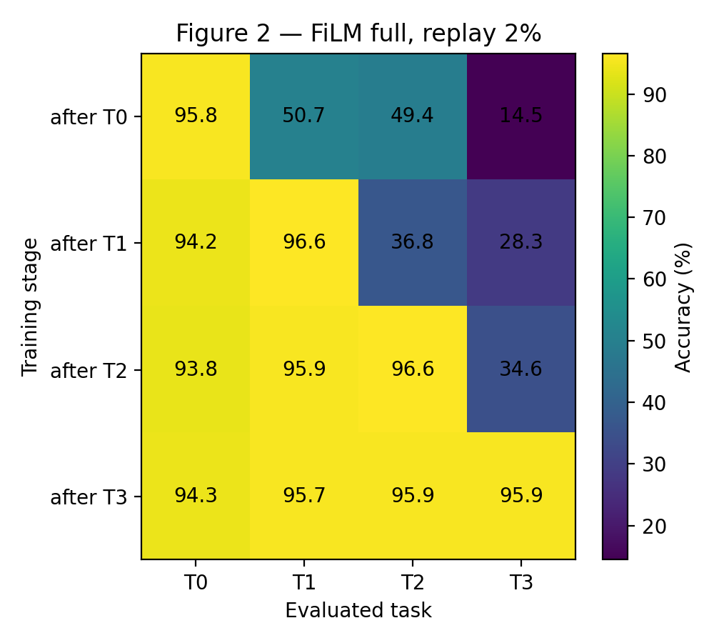
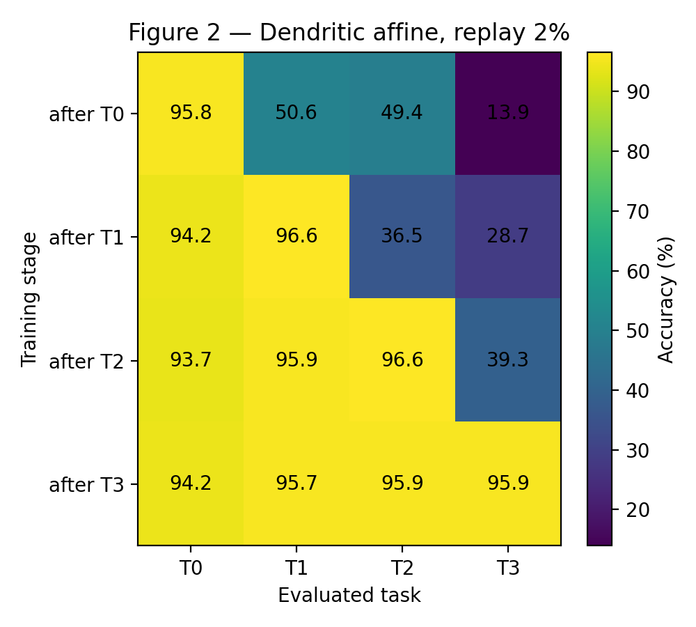
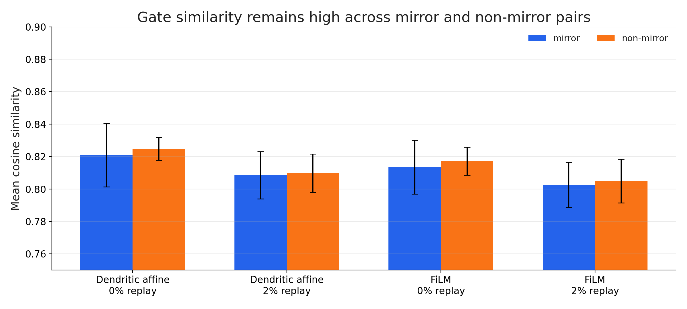

# Analysis Notes

This page contains the technical detail that is intentionally kept out of the README. The README should make the project easy to understand; this file keeps the interpretation precise.

## Architecture Equivalence

The main architectural comparison is between:

- `film_full`: FiLM-style affine modulation.
- `dendritic_affine_separate`: a dendritic-inspired separated basal/contextual implementation of the same affine primitive.

The key primitive is:

```text
h = gamma(context) * h_basal + beta(context)
```

The dendritic affine variant implements the equivalent computation:

```text
h = g(context) * h_basal + a(context)
```

Across the final replay sweep, the two models are nearly indistinguishable:

| Model | Replay | Accuracy | Forgetting |
|---|---:|---:|---:|
| `film_full` | 0% | 63.91% | 43.16% |
| `dendritic_affine_separate` | 0% | 63.83% | 43.20% |
| `film_full` | 2% | 95.44% | 1.05% |
| `dendritic_affine_separate` | 2% | 95.41% | 1.06% |
| `film_full` | 5% | 95.91% | 0.49% |
| `dendritic_affine_separate` | 5% | 95.91% | 0.42% |
| `film_full` | 10% | 96.02% | 0.31% |
| `dendritic_affine_separate` | 10% | 96.02% | 0.36% |

Interpretation: SDFC supports the need for affine contextual modulation. It does not currently support a claim that the dendritic-inspired implementation is empirically superior to FiLM.

## Replay Effect

Without replay, sequential training overwrites earlier contextual interpretations. The strongest example is task 0, the oldest task and part of the mirror-conflict pair with task 3.

| Model | Replay | Task 0 final accuracy | Task 3 final accuracy |
|---|---:|---:|---:|
| `film_full` | 0% | 27.98% | 96.29% |
| `film_full` | 2% | 94.26% | 95.93% |
| `dendritic_affine_separate` | 0% | 28.35% | 96.24% |
| `dendritic_affine_separate` | 2% | 94.19% | 95.86% |

A 2% replay buffer stores 200 examples per task in the final sweep. This is enough to raise final average accuracy from about 64% to about 95.4% and reduce forgetting from about 43% to about 1%.

Accuracy matrices are useful for inspecting this effect:

<table>
  <tr>
    <td align="center">
      
    </td>
    <td align="center">
      
    </td>
  </tr>
</table>

Full table sources:

- [`results/main_tables/table_main_performance.csv`](../results/main_tables/table_main_performance.csv)
- [`results/main_tables/table_final_task_accuracy.csv`](../results/main_tables/table_final_task_accuracy.csv)
- [`results/main_tables/table_mirror_pair_accuracy.csv`](../results/main_tables/table_mirror_pair_accuracy.csv)

## Gate Similarity Diagnostics

Gate-similarity diagnostics compare mirror and non-mirror task pairs. They should be read as descriptive diagnostics, not as a complete mechanistic explanation.

| Model | Replay | Pair type | Mean cosine similarity |
|---|---:|---|---:|
| `film_full` | 0% | mirror | 0.814 |
| `film_full` | 0% | non-mirror | 0.817 |
| `film_full` | 2% | mirror | 0.803 |
| `film_full` | 2% | non-mirror | 0.805 |
| `dendritic_affine_separate` | 0% | mirror | 0.821 |
| `dendritic_affine_separate` | 0% | non-mirror | 0.825 |
| `dendritic_affine_separate` | 2% | mirror | 0.808 |
| `dendritic_affine_separate` | 2% | non-mirror | 0.810 |

The large performance recovery under replay is not accompanied by a large separation in this simple gate-similarity measure. The cautious interpretation is that replay stabilizes an already useful contextual routing solution, rather than creating a wholly new routing organization.

<p align="center">
  
</p>

Table source:

- [`results/main_tables/table_gate_similarity_mirror_vs_nonmirror.csv`](../results/main_tables/table_gate_similarity_mirror_vs_nonmirror.csv)

## Positioning Boundaries

Current results support:

- SDFC as a compact benchmark for same-dimension feature conflict.
- Affine contextual modulation as the useful primitive in this setting.
- Functional equivalence between FiLM and the dendritic-inspired affine implementation.
- A strong replay effect: 2% per-task replay nearly closes the sequential-learning gap.

Current results do not yet support:

- A dendritic advantage over FiLM.
- Claims of improved compute efficiency, sparsity, or scalability.
- A general solution to continual learning beyond the controlled SDFC setting.
